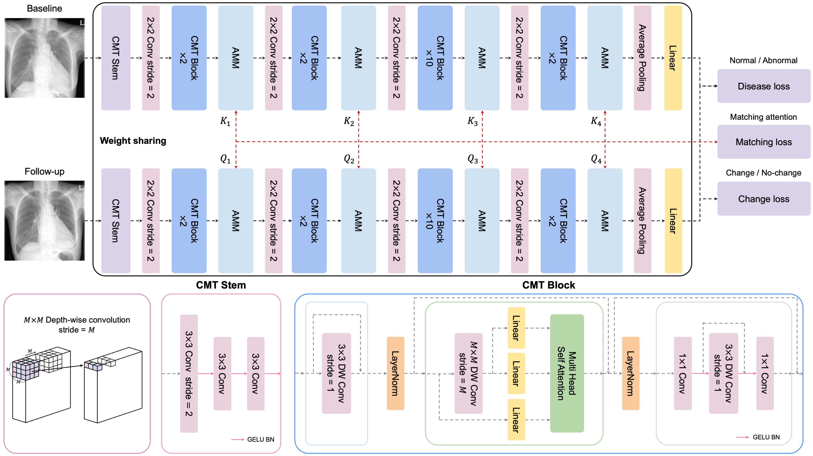

# MuSiC-ViT: Multi-task Siamese Convolutional Vision Transformer for Differentiating Change or No-change of Follow-Up Chest X-Rays

---



## Directory Architecture

Root

|---------- train.json (You have to create yourself.)

|---------- test.json (You have to create yourself.)

|---------- config.py

|---------- datasets.py

|---------- README.md

|---------- test.py

|---------- train.py

|---------- utils.py

|---------- runs (if you run the train code, it will be made automatically)

|---------- checkpoints (if you run the train code, it will be made automatically)

## Train

```
CUDA_VISIBLE_DEVICES=0 python train.py --msg=train--aug True --lr 6e-5 --batch_size=20 --print_freq=300 --backbone CMT_Ti
```

## Test

```
CUDA_VISIBLE_DEVICES=0 python test.py --msg=test --batch_size=6 --pretrained checkpoints/2022-08-25_163910_MuSiC_ViT/174048.pth --backbone CMT_Ti
```

MuSiC-ViT weight link: https://drive.google.com/drive/folders/1TZYdh4ERKBXa_-OH0LWxofGAsGWDc3_H?usp=sharing

CheXpert dataset link: https://drive.google.com/drive/folders/1wD_LI0mPlQWNWS47L44w2guuk4aHNmw-?usp=sharing